# Proyecto Monitoreo IoT - Node-RED en AWS EC2

Este repositorio contiene los flujos de Node-RED correspondientes al proyecto de fin de curso para el monitoreo de métricas de sistema (CPU, RAM, Disco) y geolocalización mediante OpenStreetMap.

## 📋 Requisitos Previos
* Una cuenta activa en **Amazon Web Services (AWS)**.
* Una instancia virtual **EC2** desplegada (Recomendado: Ubuntu Server 22.04 LTS o 24.04 LTS).
* Grupo de seguridad en AWS con los puertos **22 (SSH)** y **1880 (Node-RED)** abiertos para tráfico entrante.

## 🚀 Guía de Despliegue Paso a Paso

### Paso 1: Conexión al Servidor
Conéctate a tu instancia de AWS mediante la consola de AWS (EC2 Instance Connect) o mediante una terminal SSH local:
```bash
ssh -i "tu-clave.pem" ubuntu@TU_IP_PUBLICA_AWS
```

### Paso 2: Actualización del Sistema e Instalación de Dependencias
Ejecuta los siguientes comandos para actualizar los paquetes e instalar Node.js (necesario para correr Node-RED):
```bash
sudo apt update && sudo apt upgrade -y
curl -fsSL https://nodesource.com | sudo -E bash -
sudo apt-get install -y nodejs
```

### Paso 3: Instalación de Node-RED
Instala Node-RED de forma global en el sistema utilizando el gestor de paquetes de Node:
```bash
sudo npm install -g --unsafe-perm node-red
```

### Paso 4: Importación del Proyecto (`flows.json`)
1. Inicia Node-RED una primera vez para que cree las carpetas del sistema y luego deténlo con `Ctrl + C`:
   ```bash
   node-red
   ```
2. Dirígete a la carpeta de configuración oculta:
   ```bash
   cd ~/.node-red
   ```
3. Reemplaza o edita el archivo `flows.json` con el contenido del archivo alojado en este repositorio. Puedes usar el editor nano:
   ```bash
   nano flows.json
   ```
   *(Pega aquí todo el contenido de tu archivo JSON copiado y guarda los cambios con Ctrl+O y Ctrl+X).*

### Paso 5: Ejecutar Node-RED en Segundo Plano
Para asegurar que Node-RED se mantenga ejecutando de forma permanente en el servidor, instala y configura el administrador de procesos `pm2`:
```bash
sudo npm install -g pm2
pm2 start `which node-red` -- --max-old-space-size=256
pm2 save
pm2 startup
```

### Paso 6: Acceso a la Interfaz Gráfica
Abre tu navegador web e ingresa a la IP pública de tu servidor de Amazon acompañada del puerto predeterminado 1880:
```text
http://TU_IP_PUBLICA_AWS:1880
```
Si deseas visualizar el panel de control directamente, accede a:
```text
http://TU_IP_PUBLICA_AWS:1880/dashboard
```

## IOT
### Equipo
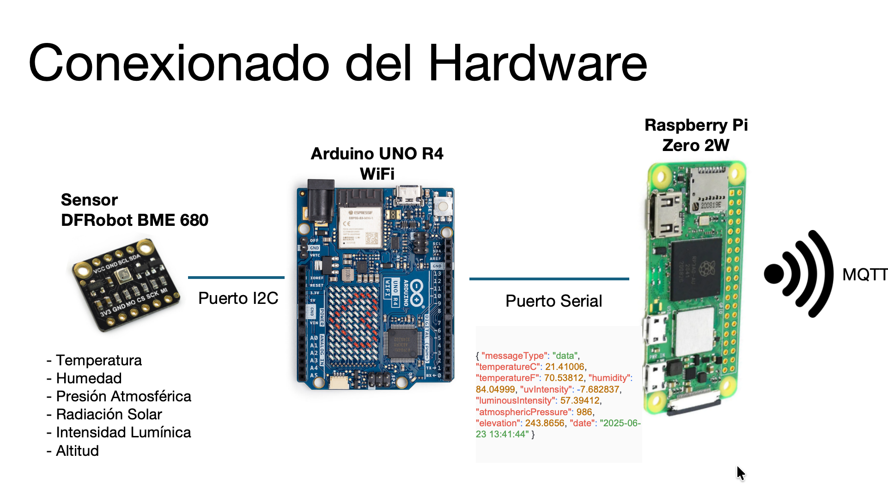

### Test
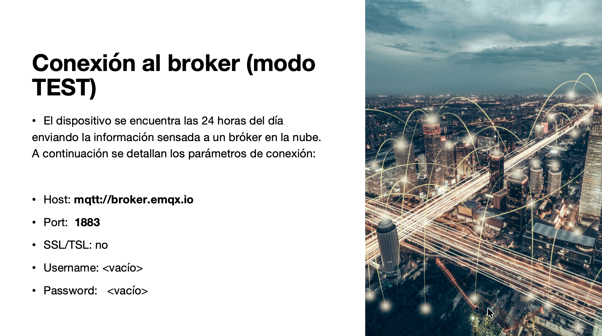

## Evidencias
### Instancias
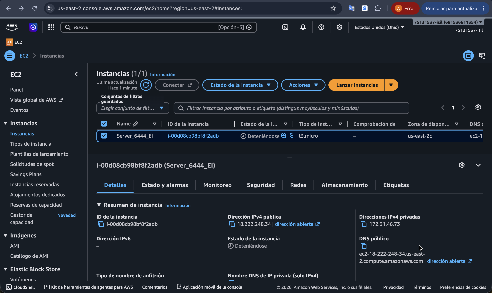
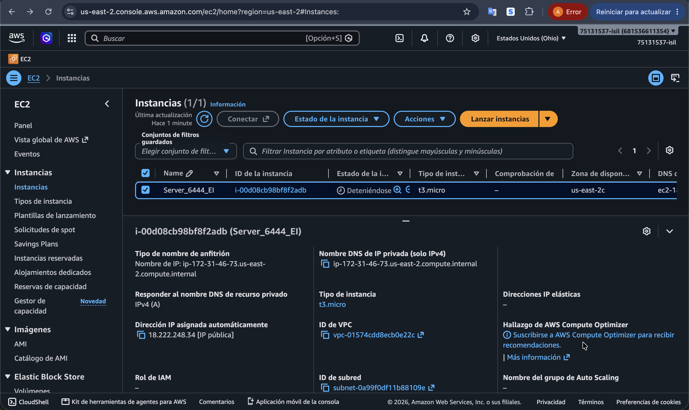
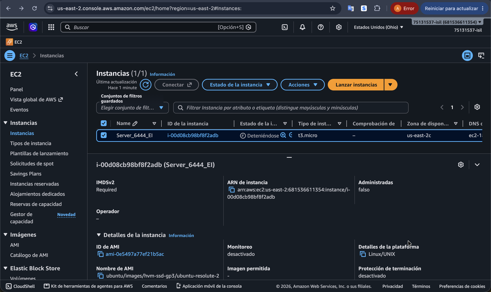
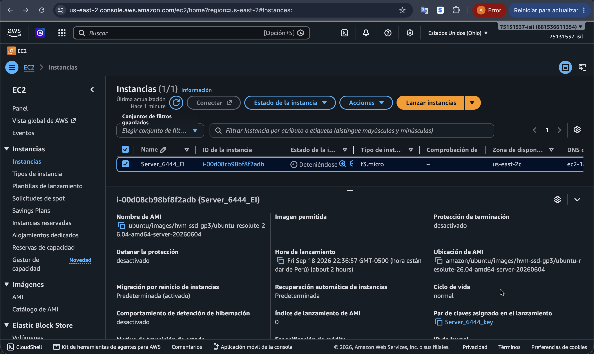
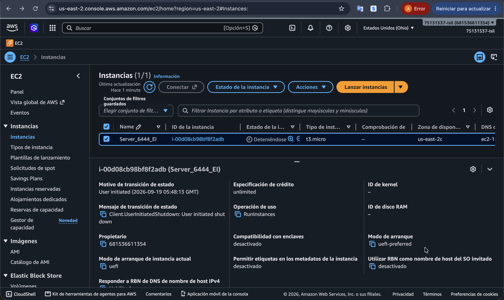

### Panel de Desarrollo 
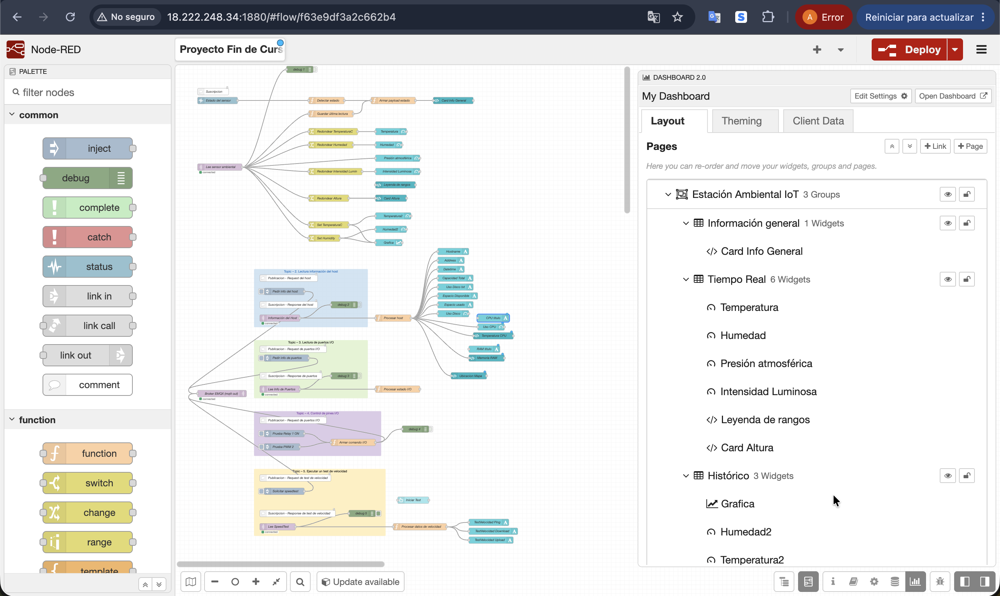
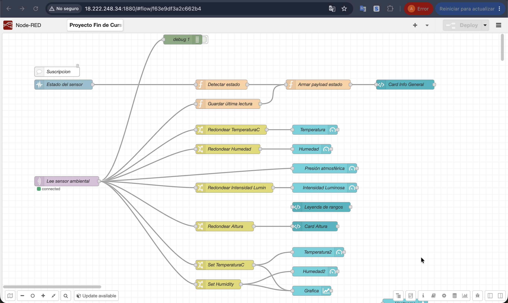
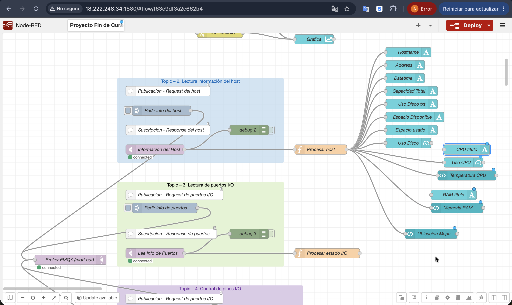
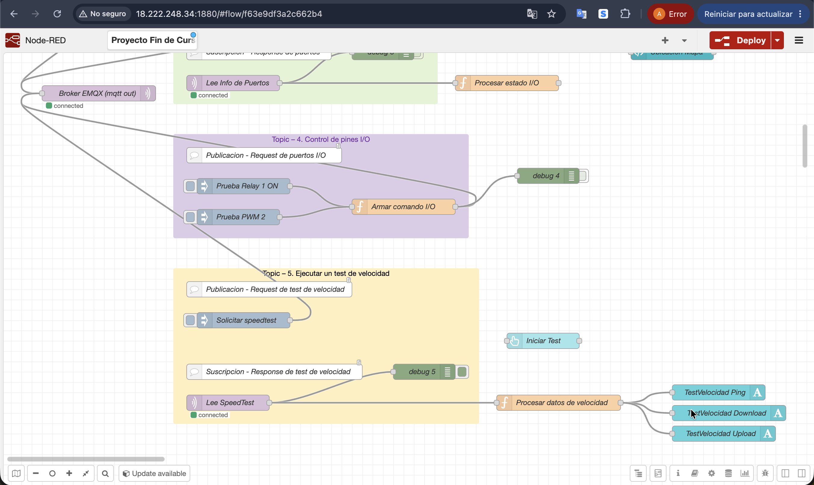

### Dashboard
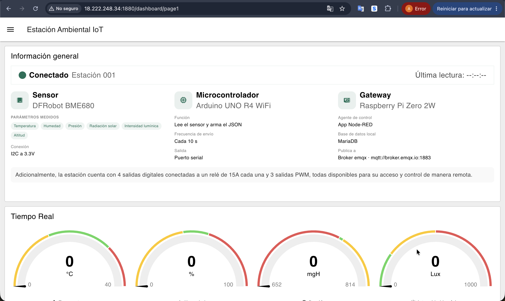
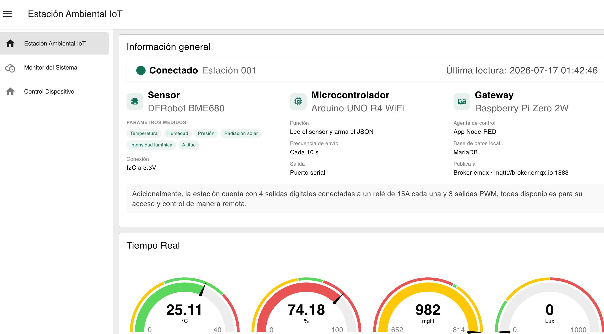
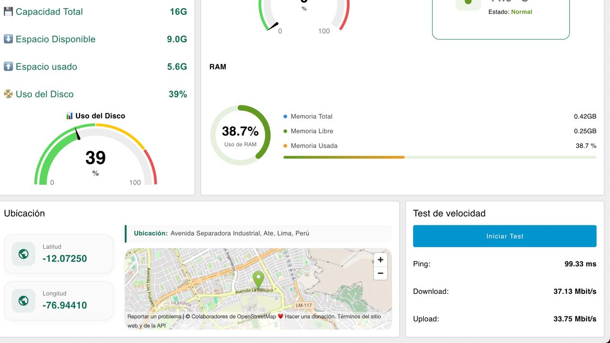
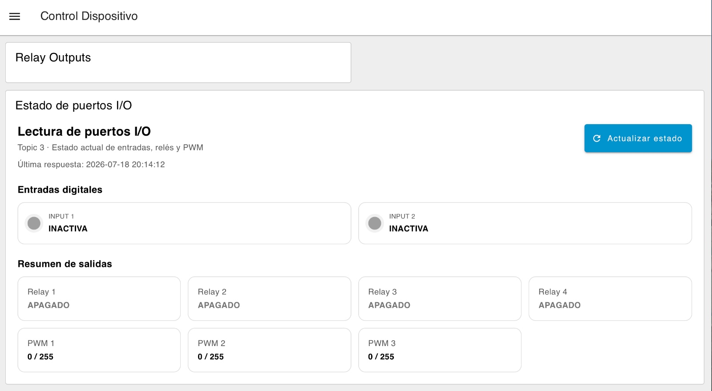
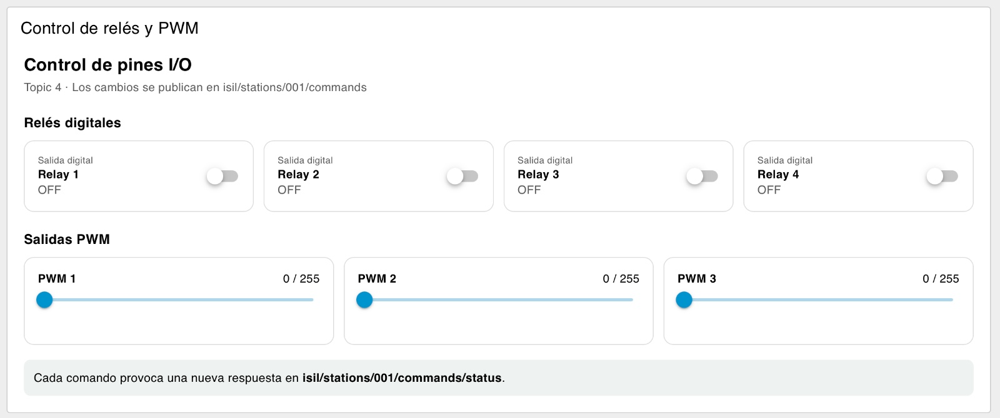